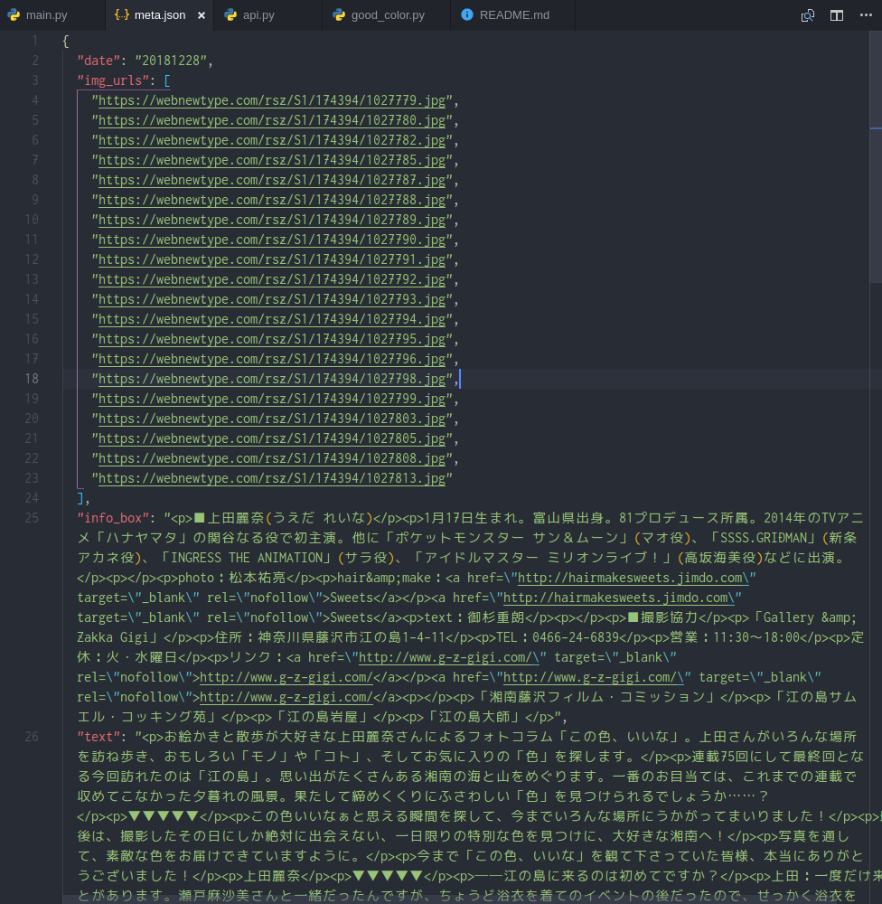

UedaReinaGoodColorCrawler
=========================

# 概要
上田麗奈さん[この色、いいな](https://webnewtype.com/column/color/)画像&記事メタデータ保存スクリプト．

# 使い方
```python
python src/main.py
```

main.py内の`output_dir`で指定したディレクトリ下に以下のフォーマットで記事メタデータ&画像が保存される．

- date(例:20181228)
  - images
    - xxxxxxx.jpg
  - meta.json

## 依存関係
- Python3.6以上
- [scrapy](https://scrapy.org/)使用してます
- 詳細は`requirements.txt`を参照．

# 仕様
## meta.jsonのデータフォーマット
- `date`: 記事の日付
- `title`: 記事のタイトル
- `url`: 記事のURL
- `text`: 記事本文のタグ付きテキスト
- `info_box`: プロフィールやお店情報が記載された部分のタグ付きテキスト



## API

```python
def get_page_urls()
""" 各記事のURLを取得する
    @param None
@return 下記dictionaryのリスト
    {
        "title": 記事タイトル,
        "url": 記事URL,
        "date": 記事の日付
    }
"""
```

```python
def download_article(article_dict, output_dir)
""" 各記事のメタデータ&画像を保存する
@param article_dict get_page_urls()の出力の1要素
@param output_dir 保存先ディレクトリパス
@return
    meta = {
        "title": 記事タイトル,
        "url": 記事URL,
        "date": 記事の日付,
        "text": 記事本文のタグ付きテキスト,
        "info_box": プロフィールやお店情報が記載された部分のタグ付きテキスト,
        "img_urls": 画像URLのリスト
    }
"""
```
